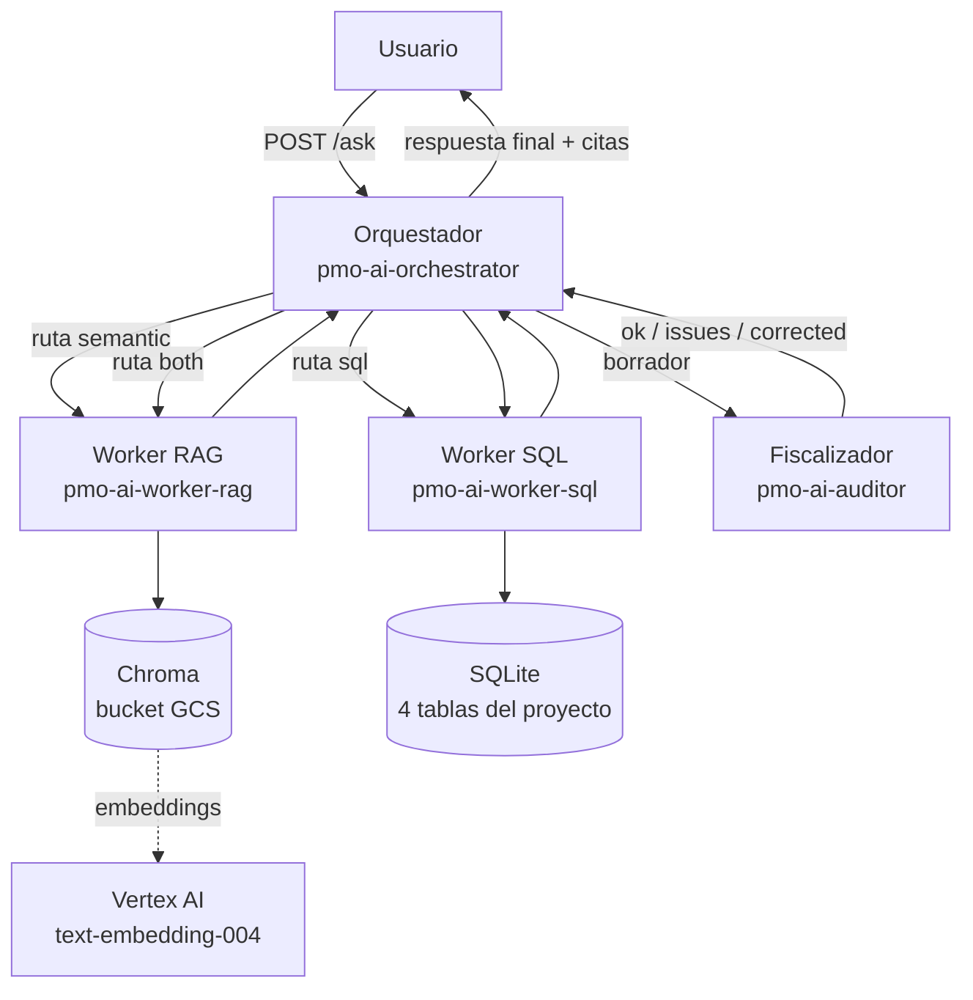

# PMO-AI — Documento de Implementación

**Curso:** Simulación Basada en Agentes — Programa de Inteligencia Artificial, UAI
**Profesor:** Ahmad Armoush
**Integrantes:** William Añez · Carlos Vizcaya · Germán Pache
**Fecha:** Agosto 2026

**Endpoint público (orquestador):** `https://pmo-ai-orchestrator-101547847876.southamerica-west1.run.app`

```bash
curl -X POST https://pmo-ai-orchestrator-101547847876.southamerica-west1.run.app/ask \
  -H "Content-Type: application/json" \
  -d '{"query": "¿cuántos hitos están vencidos y qué riesgo los causa?"}'
```

---

## 1. Metodología de trabajo

Seguimos el roadmap del taller ("10 pasos para llevar un agente a producción") como guía, pero lo ejecutamos de forma incremental: primero pusimos en producción un único agente RAG funcionando de punta a punta (documento → embeddings → vector DB → respuesta con citas → deploy en Cloud Run), y recién después lo descompusimos en la arquitectura multi-agente completa. Esta decisión nos permitió tener algo desplegado y demostrable desde la primera semana, y que cada agente nuevo se integrara sobre una base ya probada.

El flujo de trabajo fue:

1. **Documento de negocio primero.** Antes de escribir código construimos el documento fuente del proyecto (`data/PMO-FER-2025-014_...md`): un reporte PMO completo con ficha, hitos, riesgos, métricas y presupuesto. Queríamos un documento denso para que las preguntas al agente fueran interesantes (hitos vencidos, riesgos críticos, desvíos de presupuesto).
2. **RAG mínimo viable.** Chunking por secciones, embeddings con Vertex AI, Chroma como base vectorial y DeepSeek como LLM. Validado con 5 consultas reales antes de seguir.
3. **Arquitectura de 4 agentes.** Con el RAG funcionando, escribimos el masterplan (diagrama de la arquitectura completa) y construimos orquestador, worker SQL y fiscalizador, verificando la integración completa en local antes de desplegar.
4. **Despliegue independiente.** Cada agente es un servicio Cloud Run separado, con su propio Dockerfile, y se comunican por HTTP.

Todo el trabajo quedó versionado en GitHub con commits por hito, y cada agente tiene su propio `AGENTE.md` con detalle técnico (este documento es la vista consolidada).

## 2. Componentes

### 2.1 Arquitectura general



### 2.2 Los 4 agentes

| Agente | Qué hace | Paso del roadmap |
|---|---|---|
| **Orquestador** | Recibe la consulta, un router con DeepSeek (temperatura 0, salida JSON) decide la ruta (`semantic` / `sql` / `both`), delega por HTTP, fusiona los resultados y los manda a fiscalizar | 3 |
| **Worker RAG** | Búsqueda semántica KNN (k=5) sobre los documentos PMO. Chunking por secciones de markdown, embeddings `text-embedding-004`, Chroma persistido en un bucket GCS montado como volumen | 2 y 6 |
| **Worker SQL** | Text-to-SQL: DeepSeek genera la consulta (solo SELECT, ejecutada en modo read-only) sobre 4 tablas (hitos, riesgos, métricas, presupuesto) extraídas del documento, y redacta la respuesta mostrando el SQL ejecutado | 4 |
| **Fiscalizador** | Valida cada respuesta antes de entregarla: que cite fuentes, que no exponga PII y que responda la pregunta original. Devuelve `{ok, issues, corrected}`; si corrige, el usuario recibe la versión corregida | 5 |

### 2.3 Infraestructura GCP

- **Proyecto:** `pmo-ai-504313` — **Región:** `southamerica-west1` (Santiago) para todos los servicios
- **4 servicios Cloud Run** independientes, uno por agente, cada uno con su Dockerfile en su directorio (`src/<agente>/Dockerfile`)
- **Cloud Build** con un `cloudbuild.yaml` parametrizado para construir cada imagen con el contexto de la raíz del repo
- **Cloud Storage:** bucket `pmo-ai-vectordb` con el índice Chroma, montado en el worker RAG via Cloud Storage FUSE
- **Secret Manager:** la API key de DeepSeek vive ahí; Cloud Run la inyecta como variable de entorno (nunca en código ni en el repo)
- **Service account** `pmo-ai-sa` con privilegios mínimos (Vertex AI, lectura del bucket, lectura de secretos)

## 3. Decisiones importantes

**1. LLM: DeepSeek en vez de OpenAI.** Decidimos como equipo usar DeepSeek (`deepseek-chat`) para todos los agentes: la API es compatible con el SDK de OpenAI (solo cambia `base_url`), el costo es mucho menor y la calidad en español fue suficiente para nuestro caso. La contrapartida es que DeepSeek no ofrece embeddings, lo que nos llevó a la siguiente decisión.

**2. Embeddings: Vertex AI, pero en otra región.** Queríamos todo en Santiago (`southamerica-west1`), pero descubrimos en ejecución que los modelos de embeddings de Vertex AI no están disponibles en esa región (probamos `text-embedding-004` y `gemini-embedding-001`, ambos 404). Decidimos que solo el endpoint de vectorización corriera en `us-central1` (variable `EMBED_REGION`): el texto viaja para vectorizarse pero no se almacena fuera de región, y todo lo demás (servicios, bucket, secretos) quedó en Santiago.

**3. Chunking por secciones de markdown, no por tamaño fijo.** Nuestros documentos PMO tienen secciones numeradas ("4. Hitos", "5. Riesgos activos"). Chunkear por headers preserva la unidad semántica y, más importante, nos da la metadata de sección que hace posible la trazabilidad: cada cita dice `(Fuente: archivo, Sección: X)` y es verificable contra el documento original. Fue la decisión que más impactó en la calidad de las respuestas.

**4. Router por LLM, no por reglas.** El orquestador decide la delegación con DeepSeek a temperatura 0 y salida JSON forzada, usando criterios declarativos en el prompt ("cuántos/total/promedio" → SQL; "qué dice/estado/riesgos" → semántico). Evaluamos usar regex o keywords, pero los criterios son semánticos y el LLM los generaliza mejor; la temperatura 0 garantiza que la misma pregunta tome siempre la misma ruta.

**5. Degradación elegante.** Si la ruta elegida requiere un worker que no está disponible, el orquestador cae al worker RAG y agrega una nota explícita al usuario ("worker SQL aún no disponible"). La plataforma nunca se cae por completo y el usuario siempre sabe qué pasó.

**6. Fiscalizador con corrección restrictiva.** El prompt del fiscalizador le prohíbe inventar datos: solo puede reformular, eliminar lo no citado o agregar aclaraciones. En una prueba real de integración, detectó que el worker RAG y el worker SQL se contradecían (uno decía que el dato no existía y el otro que había 4 riesgos), devolvió `ok=false` con 3 issues concretos, y el usuario recibió la versión corregida que aclaraba la procedencia de cada cifra. Fue la prueba que más nos convenció del valor de este agente.

**7. Guard de seguridad doble en el worker SQL.** El SQL generado por el LLM pasa por dos filtros: validación de que sea una única sentencia SELECT, y ejecución en modo read-only a nivel de conexión SQLite. Confiamos en el LLM para generar SQL correcto, pero no para que nunca genere algo destructivo.

**8. SQLite sobre FUSE: lo sabemos, es deuda técnica.** El índice Chroma (que usa SQLite interno) vive en un bucket montado por FUSE. Sabemos que SQLite sobre FUSE no tolera escrituras concurrentes; lo aceptamos porque el patrón es de lectura con una sola instancia. Si el sistema creciera, migraríamos a pgvector en Cloud SQL o a Qdrant.

## 4. Resultados de validación

Probamos el endpoint público del orquestador con las 4 categorías de preguntas del proyecto:

| Consulta | Ruta | Workers | Resultado |
|---|---|---|---|
| Estado del portafolio | semantic | rag | Correcta, con citas por sección |
| Hitos vencidos y riesgo causante | both | rag + sql | Fiscalizador corrigió inconsistencia; respuesta final coherente |
| Conteo de riesgos por exposición | sql | sql | SQL generado correcto, cifra exacta (4) |
| Métricas de desempeño (SPI, CPI) | semantic | rag | SPI 0,89 y CPI 1,02 exactos |

- **Latencia:** ~8 s consultas simples, ~15–29 s consultas mixtas con fiscalización
- **Costo estimado:** < US$1 por 1.000 consultas

## 5. Trazabilidad (paso 7 del roadmap)

Implementado: tabla `interactions` (SQLite, cliente nativo) que registra cada consulta del orquestador — `id, timestamp, query, response, tokens, latency`. Persiste en `gs://pmo-ai-vectordb/interactions/interactions.db`, montado por Cloud Storage FUSE (mismo mecanismo que Chroma). El orquestador corre con `--max-instances=1` para evitar escrituras concurrentes sobre SQLite-sobre-FUSE.

Los tokens se capturan sumando el `usage.total_tokens` de las 2 a 4 llamadas LLM que puede disparar una interacción (router, worker(s) delegado(s), fiscalizador). El total viaja también en la respuesta de `/ask` y se expone en `GET /stats` (agregados: total de interacciones, tokens y latencia totales/promedio/min/max) — nunca expone `query`/`response` individuales, ya que el endpoint es público sin auth.

`cli.py` consume ambos: muestra los tokens de cada respuesta en la metadata, y el subcomando `uv run cli.py stats` imprime los agregados. Detalle completo del diseño en `secret-zone/PLAN-trazabilidad.md`.

## 6. Trabajo futuro

1. Endurecer la comunicación interna: que workers y fiscalizador solo acepten llamadas del orquestador (IAM entre servicios, hoy son públicos).
2. Evaluación formal del retriever: 10 consultas con precisión@k medida manualmente y prueba de hybrid search (paso 6).
3. Paralelizar las llamadas a workers en la ruta `both` (hoy son secuenciales, casi duplica la latencia).
4. Capa determinista de detección de PII (regex para RUT, tarjetas, emails) complementando al fiscalizador.

## 7. Repositorio y cómo probar

**Repo:** estructura `src/{orchestrator, worker_rag, worker_sql, auditor}` + `data/` (documentos) + `docs/` (este documento y propuestas) + `cloudbuild.yaml`. Cada agente tiene su `AGENTE.md` con detalle técnico, decisiones y limitaciones.

**Local:** `uv pip install -r requirements.txt`, levantar los 4 servicios con `uvicorn` en puertos 8080–8083 y apuntar el orquestador a ellos con variables de entorno (instrucciones completas en cada `AGENTE.md`).
